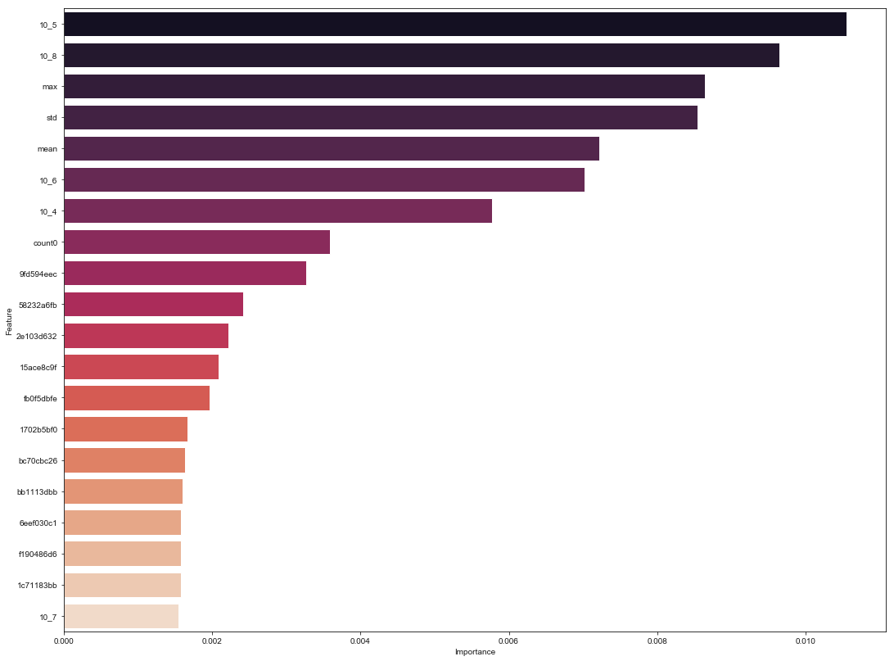
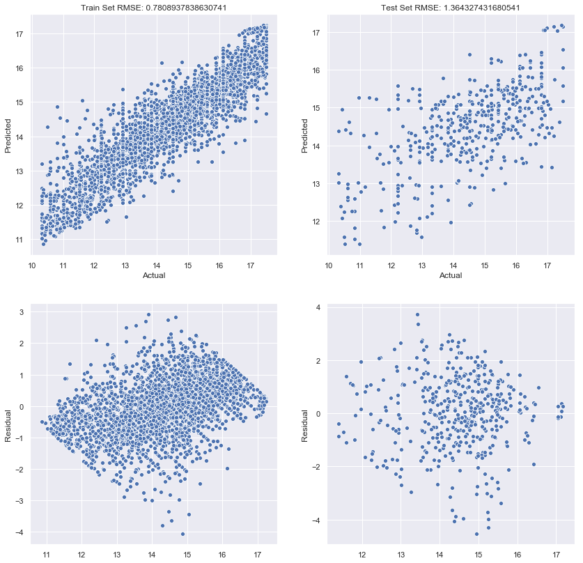

# This work explains the Machine Learning approach taken to Predict future transaction for a given Customer on Santander Dataset for a Kaggle Competition


```python
%%time
#import the required modules
import pandas as pd
import numpy as np
from sklearn.model_selection import train_test_split 
from sklearn.pipeline import Pipeline
from sklearn.preprocessing import MaxAbsScaler
from sklearn.ensemble import RandomForestRegressor
from sklearn.model_selection import GridSearchCV,cross_val_score 
from sklearn.metrics import mean_squared_error,make_scorer,r2_score
from sklearn.dummy import DummyRegressor
from lightgbm import LGBMRegressor
import matplotlib.pyplot as plt
import seaborn as sns
import os
%matplotlib inline
seed = 10
```

    Wall time: 2.25 s
    


```python
#define a function to read the data
def read_data(inpath):
    df = pd.read_csv(inpath)
    print('Shape of the Input Dataset:',df.shape)
    return df
```


```python
#read the training data
fname = 'train.csv.zip' #file name
inpath = os.path.join(os.getcwd(),'data',fname) #input path
df_train = read_data(inpath)
```

    Shape of the Input Dataset: (4459, 4993)
    


```python
#split df into X,Y 
X = df_train.drop(['target','ID'],axis=1).sort_index(axis=1,inplace=False)#don't need 'ID' in feature matrix
Y = df_train.target.copy()
```

#### Drop the Columns with 0 variance.


```python
zero_var = []
col_list = X.columns.tolist() # list of predictor columns
total_values = X.shape[0]

for col in col_list:
    series = X[col].value_counts().sort_values(ascending=False)
    if series[0]/total_values == 1:
        zero_var.append(col)
print('Number of columns with 0 Variance: ',len(zero_var))

#dropping these columns from X
X.drop(zero_var,axis=1,inplace=True)
print('Shape of X:',X.shape)
```

    Number of columns with 0 Variance:  256
    Shape of X: (4459, 4735)
    

#### Create New Features


```python
#define a function to create new features
def create_new(df):
    #create max column
    
    max_col,mean_col,count0_col = df.max(axis=1),np.round(df.mean(axis=1),2),df.applymap(lambda x: x== 0).sum(axis=1)
    std_col,skew_col,kurt_col = np.round(df.std(axis=1),2),np.round(df.skew(axis=1),2),np.round(df.kurtosis(axis=1))
    
    #create bin features
    zero_bin = df.applymap(lambda x: x<1000).sum(axis=1)
    first_bin = df.applymap(lambda x: x>=1000 and x<10000).sum(axis=1)
    second_bin = df.applymap(lambda x: x>=10000 and x<100000).sum(axis=1)
    third_bin = df.applymap(lambda x: x>=100000 and x<1000000).sum(axis=1)
    fourth_bin = df.applymap(lambda x: x>=1000000 and x<10000000).sum(axis=1)
    fifth_bin = df.applymap(lambda x: x>=10000000 and x<100000000).sum(axis=1)
    
    df['max'] = max_col

    #create mean column
    df['mean'] = mean_col

    #create std column
    df['std'] = std_col
    
    #create skew column
    df['skew'] = skew_col
    
    #create kurtosis as column
    df['kurtosis'] = kurt_col

    #create count0 column
    df['count0'] = count0_col
    
    #create zero_bin
    df['10_3'] = zero_bin
    #adding all bins
    df['10_4'],df['10_5'],df['10_6'],df['10_7'],df['10_8']= first_bin,second_bin,third_bin,fourth_bin,fifth_bin
    
    return df
```


```python
%%time
X = create_new(X)
print('Shape of df_train:',X.shape)
```

    Shape of df_train: (4459, 4747)
    Wall time: 49.2 s
    


```python
#Splitting the dataset into Training and Test Set
def split(pred,target,test_size = 0.1,seed=seed):
    X,Y = pred.values,np.log1p(target.values)
    X_train,X_test,Y_train,Y_test = train_test_split(X,Y,test_size = test_size,shuffle=True,random_state=seed)
    print('X_train Shape:', X_train.shape)
    print('X_test Shape:', X_test.shape)
    print('Y_train Shape:', Y_train.shape)
    print('Y_test Shape:', Y_test.shape)
    return X_train,X_test,Y_train,Y_test
```


```python
%%time
X_train, X_test, Y_train, Y_test = split(X,Y)
```

    X_train Shape: (4013, 4747)
    X_test Shape: (446, 4747)
    Y_train Shape: (4013,)
    Y_test Shape: (446,)
    Wall time: 833 ms
    

#### Train a Random Forest Model to identify Important features that shows predictive power
--> We will train a random forest model. Replace each feature with permutation of the same feature. Note the drop in Rsquare. Do the same for all features. Greater the drop greater the importance of that feature in predicting the target


```python
#Defining the Pipeline
chain = [('max_scaler',MaxAbsScaler()),('ml_model',RandomForestRegressor(n_estimators=600,
                            min_samples_leaf=5,max_features=13,random_state=seed,n_jobs=-1))]
feature_selector = Pipeline(chain)
```


```python
%%time
#Fit the pipe on Training Set
regressor = feature_selector.fit(X_train,Y_train) 
```

    Wall time: 6.28 s
    


```python
#define a function to calculate feature importances
def permute_feature_importance(estimator,X_valid,Y_valid,features):
    Y_valid_pred = estimator.predict(X_valid)
    base_score = r2_score(Y_valid,Y_valid_pred)
    imp = []
    
    assert len(features) == X_valid.shape[1],"The feature length and input array doesn't Match"
        
    
    for i,col in enumerate(features):
        save = np.copy(X_valid[:,i]) #make a copy
        X_valid[:,i] = np.random.permutation(X_valid[:,i]) #perform permutation
        
        new_score = r2_score(Y_valid,estimator.predict(X_valid))
        
        imp.append((col,base_score-new_score))
        
        X_valid[:,i] = np.copy(save)
        
    imp.sort(key=lambda x:x[1],reverse=True)
    
    return pd.DataFrame(imp,columns=['feature','importance'])
```


```python
%%time
features = X.columns.tolist()
#call the function
importance_df = permute_feature_importance(regressor,X_test,Y_test,features)
```

    Wall time: 16min 27s
    


```python
#plot the features 
rows, cols = 1,1
fig_size = (18,14)

fig, ax = plt.subplots(ncols=cols,nrows=rows,figsize = fig_size)

sns.set()
bar = sns.barplot(x='importance',y='feature',palette='rocket',data=importance_df[:20],ax=ax)
bar.set_xlabel('Importance')
bar.set_ylabel('Feature')
```


    Text(0,0.5,'Feature')





```python
col_zero_imp = importance_df[importance_df.importance <= 0].feature.tolist()
print('Number of Zero Importance columns:',len(col_zero_imp))
```

    Number of Zero Importance columns: 2805
    


```python
#read the training data
fname = 'feature_importance_v2.csv'
opath = os.path.join(os.getcwd(),'data',fname)
importance_df.to_csv(opath,index=False,header=True)
```

#### Drop columns with Importance <= 0


```python
#read the feature importance file
fname = 'feature_importance_v2.csv'
inpath = os.path.join(os.getcwd(),'data',fname)
feature_imp = pd.read_csv(inpath)

zero_imp = feature_imp[feature_imp.importance <= 0].feature.tolist()
#zero_imp = list(map(lambda x: x+'_bin',zero_imp))
#drop zero_imp columns
X.drop(zero_imp,axis=1,inplace=True)
print('Shape of X:',X.shape)
```

    Shape of X: (4459, 2309)
    

#### Drop low importance columns


```python
n_features = 800 #features to keep
superset = set(feature_imp.feature.tolist()).difference(set(zero_imp)) #All features
keep_feature = set(feature_imp.feature[:n_features].tolist()) #features to keep

drop_features = list(superset.difference(keep_feature)) #features to drop
#drop_features = list(map(lambda x: x+'_bin',drop_features))
#dropping these columns from df_train
X.drop(drop_features,axis=1,inplace=True)
print('Shape of df_train:',X.shape)
```

    Shape of df_train: (4459, 800)
    

#### Train a Gradient Boosting Algorithm to make final predictions


```python
# Step 4: define the ML Model
ml_model = LGBMRegressor(learning_rate=0.005,n_estimators=700,num_leaves=90,colsample_bytree=0.5)

#define the pipeline
chain = [('max_scaler',MaxAbsScaler()),('ml_model',ml_model)]

pipe = Pipeline(chain)

#define the scorer
scorer = make_scorer(mean_squared_error,greater_is_better=False)
```


```python
%%time
rmsle_cv = np.round(np.sqrt(np.mean(np.abs(cross_val_score(pipe,X_train,Y_train,scoring=scorer,cv=10,n_jobs=-1)))),3)
print('RMSLE for CV: ',rmsle_cv)
```

    RMSLE for CV:  1.347
    Wall time: 10min 19s
    


```python
%%time
#fit the model on full train set
regressor = pipe.fit(X_train,Y_train)
```

    Wall time: 1min 15s
    

#### Analyzing the Performance on Train/Test Set


```python
#define a function to make predictions and get train and test error
def get_prediction(estimator,X_train,Y_train,X_test,Y_test):
    Y_train_pred = estimator.predict(X_train) #prediction on training set
    rmse_train = np.sqrt(mean_squared_error(Y_train,Y_train_pred)) #train rmse

    Y_test_pred = estimator.predict(X_test) #prediction on test set
    rmse_test = np.sqrt(mean_squared_error(Y_test,Y_test_pred))#test rmse

    fig_size = (14,14)
    rows, cols = 2,2

    fig, ax = plt.subplots(ncols=cols,nrows=rows,figsize = fig_size)
    sns.set()

    train_title = 'Train Set RMSE: '+ str(rmse_train)
    test_title = 'Test Set RMSE: ' + str(rmse_test)

    scatter1 = sns.scatterplot(Y_train,Y_train_pred,ax=ax[0][0])
    scatter1.set_title(train_title)
    scatter1.set_xlabel('Actual')
    scatter1.set_ylabel('Predicted')
    
    scatter2  = sns.scatterplot(Y_test,Y_test_pred,ax=ax[0][1])
    scatter2.set_title(test_title)
    scatter2.set_xlabel('Actual')
    scatter2.set_ylabel('Predicted')    
    
    resid_train = Y_train - Y_train_pred
    scatter3 = sns.scatterplot(y=resid_train,x=Y_train_pred,ax=ax[1][0])
    scatter3.set_ylabel('Residual')
    
    resid_test = Y_test - Y_test_pred
    scatter4 = sns.scatterplot(y=resid_test,x=Y_test_pred,ax=ax[1][1])
    scatter4.set_ylabel('Residual')
    
    return scatter1, scatter2,scatter3,scatter4
```


```python
#X_test_scaled = X_scaler.transform(X_test)
#Y_test_scaled = Y_scaler.transform(Y_test)
_,_,_,_ = get_prediction(regressor,X_train,Y_train,X_test,Y_test)
```





#### Comparing with Dummy Model


```python
#calculate train rmse
dumb_train_model_mean_pred = DummyRegressor(strategy='mean').fit(X_train,Y_train).predict(X_train)
print('Train RMSE for Dummy Model: ',np.sqrt(mean_squared_error(Y_train,dumb_train_model_mean_pred)))

#calculate test rmse
dumb_test_model_mean_pred = DummyRegressor(strategy='mean').fit(X_test,Y_test).predict(X_test)
print('Test RMSE for Dummy Model: ',np.sqrt(mean_squared_error(Y_test,dumb_test_model_mean_pred)))

```

    Train RMSE for Dummy Model:  1.7530220506277143
    Test RMSE for Dummy Model:  1.7301431116103483
    

### Making Predictions on the Final Data


```python
X_total,_,Y_total,_ = split(X,Y,test_size=0,seed=10)
```

    X_train Shape: (4459, 800)
    X_test Shape: (0, 800)
    Y_train Shape: (4459,)
    Y_test Shape: (0,)
    


```python
%%time
regressor_final = pipe.fit(X_total,Y_total) #fit the pipe on entire data
```

    Wall time: 40.1 s
    


```python
%%time
#import the test data
test_file = 'test.csv.zip'
test_path = os.path.join(os.getcwd(),'data',test_file)
df_test = read_data(test_path)
```

    Shape of the Input Dataset: (49342, 4992)
    Wall time: 1min 7s
    


```python
#drop ID from test data
test = df_test.drop(['ID'],axis=1).sort_index(axis=1,inplace=False)

#dropping 0 variance columns
test.drop(zero_var,axis=1,inplace=True)
print('Shape of df_test: ',test.shape)

```

    Shape of df_test:  (49342, 4735)
    


```python
#create new features
test = create_new(test)
print('Shape of df_test:',test.shape)
```

    Shape of df_test: (49342, 4747)
    


```python
#drop zero_imp columns
test.drop(zero_imp,axis=1,inplace=True)
print('Shape of test:',test.shape)
```

    Shape of test: (49342, 2309)
    


```python
#dropping low importance columns from df_train
test.drop(drop_features,axis=1,inplace=True)
print('Shape of df_test:',test.shape)
```

    Shape of df_test: (49342, 800)
    


```python
%%time
#make predictions
X_test_final = test.values
Y_test_final = np.round(np.expm1(regressor_final.predict(X_test_final)),2)
print('Shape of Y_test_final: ',Y_test_final.shape)
```

    Shape of Y_test_final:  (49342,)
    Wall time: 6.12 s
    


```python
#save the predictions to a file
submsn_file = 'submission_lgb_v2.csv'
submsn_path = os.path.join(os.getcwd(),'submission',submsn_file)

submsn_dict = dict(ID = df_test.ID.values.tolist(),target = Y_test_final.tolist())
submsn_df = pd.DataFrame(submsn_dict)
submsn_df.to_csv(submsn_path,index=False,header=True)
```
